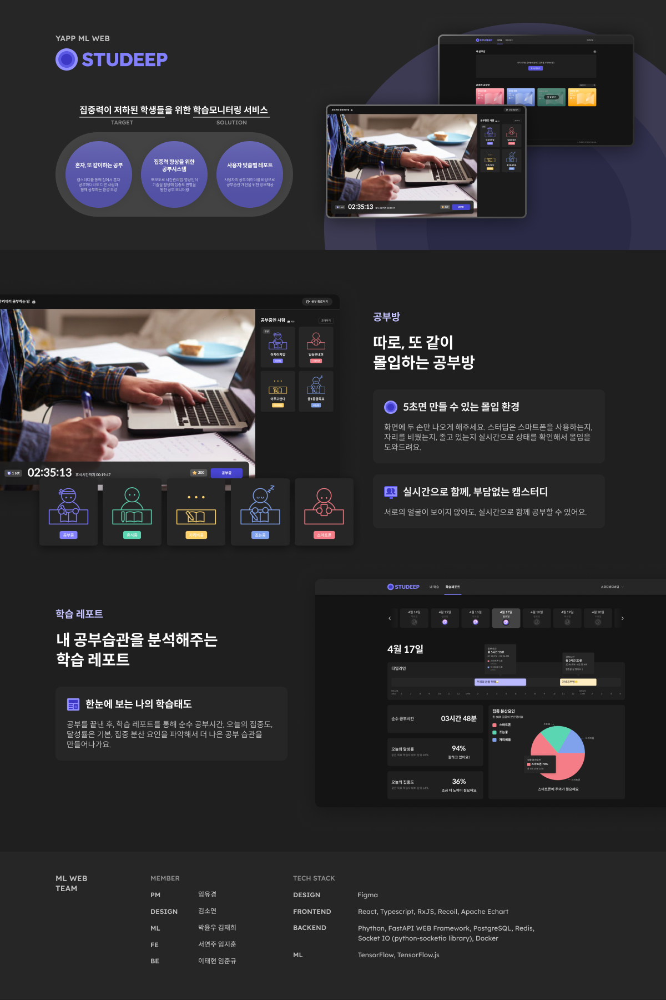

# Studeep API Server✨
### **내 꿈을 향해 깊은 곳으로, 스터딥**

학습 모니터링을 통해 몰입환경을 만들어주는 공부 습관 개선 서비스 

**집에서 집중하기, 잘하고 계신가요?** 

코로나 19로 온라인 개학과 원격 수업이 자리 잡은 환경에서, 집에서 일과 공부를 새로운 방식으로 하는 걸 쉽게 확인할 수 있어요. 이제는 집이라는 공간에서 학업과 업무 그리고 휴식까지 24시간을 함께 하는 공간이 되었고, 그곳에서 각자 공부와 일에 집중하기 위해 큰 노력을 기울이고 있어요. 

그래서 "집이라는 공간에서도 몰입할 수 있는 환경을 어떻게 만들 수 있을까?"라는 질문에서, 스터딥이 시작되었어요. 학습 모니터링을 통해 5초면 몰입할 수 있는 환경을 만들어드릴게요.

## Live Service
[Studeep](https://www.studeep.com)

## Getting Started
```
// 의존성 설치
pip install -r requirements.txt

// DB Migration
PYTHONPATH=. alembic revision --autogenerate -m "migration name"   
PYTHONPATH=. alembic upgrade head   

// 서버 실행
python3 -m app.main
```


## Production


## Architecture


## Modeling


## API Docs
[Swagger](https://www.studeep.com/docs)


